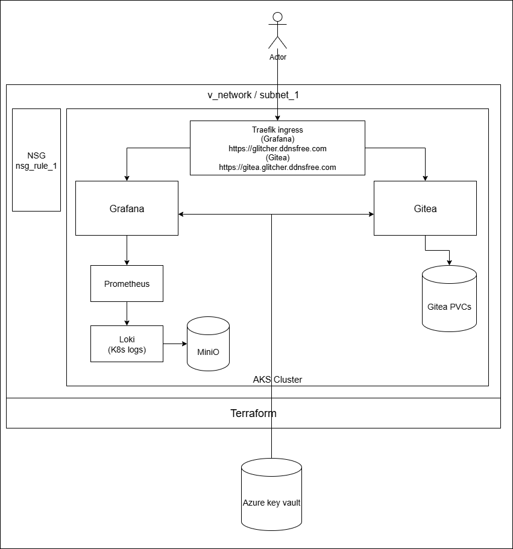

# Monitoring & Ingress Stack on AKS

## Overview
This project deploys a monitoring and ingress stack on an Azure Kubernetes Service (AKS) cluster using **Helm** and **GitHub Actions** for CI/CD.  
It includes:
- **Traefik** (ingress controller, HTTPS termination, Let's Encrypt certificates)
- **Grafana** (visualization)
- **Prometheus** (metrics collection)
- **Loki** (log aggregation)
- **Alloy** (Kubernetes log forwarding to Loki)
- **MinIO** (object storage for Loki chunks)
- **Gitea** (self-hosted Git service)

Gitea accessible at: https://gitea.glitcher.ddnsfree.com
Grafana portal accessible at: https://glitcher.ddnsfree.com

---

<p align="center">
  
</p>
<p align="center">
  
</p>

---

## Architecture



---

**Current flow:**
1. **Traefik** handles HTTP & HTTPS traffic.
   - Configured via `IngressRoute`.
   - HTTPS certificates managed via Let's Encrypt.
2. **Grafana**
   - Pre-provisioned with Loki & Prometheus datasources.
   - Password is stored in Azure Key Vault.
   - Currently **publicly accessible**.
3. **Prometheus**
   - Installed via `prometheus-community/kube-prometheus-stack`.
4. **Loki**
   - Single binary mode.
   - Uses MinIO backend (also deployed in the cluster).
   - Alloy sends Kubernetes pod logs to Loki.
5. **MinIO**
   - Provides object storage for Loki chunks.
   - Ephermal.
6. **Gitea**
   - Persistent storage with PVC.
7. **Azure Key Vault**
   - Stores sensitive values (Grafana admin password, Traefik API token).

---

## Deployment

### Prerequisites
- Azure CLI
- kubectl
- Helm
- Terraform
- GitHub Actions configured for OIDC authentication with Azure

### Steps
1. **Cluster creation**  
   Provision AKS with Terraform.
2. **Deploy Helm charts**  
   Applied via GitHub Actions pipeline:
   - Traefik
   - kube-prometheus-stack
   - Loki (single binary mode)
   - Alloy
   - MinIO
   - Gitea
3. **Ingress & DNS**
   - Traefik configured with `IngressRoute`.
   - DNS updated via [Dynu API](https://www.dynu.com/) using GitHub Actions.
   - DNS script runs on infra deployments; IP changes trigger an update.
4. **Secrets**
   - Fetched from Azure Key Vault in CI/CD pipeline before deployment.

### CLI Deployment, Configuration, Teardown

```bash
terraform apply -auto-approve -var="location=LOCAION" -var="environment=ENVIRONMENT"
az aks get-credentials --resource-group RG_main_LOCATION_ENVIRONMENT --name AKS_cluster --overwrite-existing
bash deploy-apps.sh
bash update-dns.sh
bash update-ingress.sh
```

---

## CI/CD Workflow
- GitHub Actions runs `helm upgrade --install` commands and `kubectl apply` for manifests.
- DNS update script calls:
  ```bash
  curl -X POST "https://api.dynu.com/v2/dns/"
---

## Project Structure

<pre> 
├───.github
│   └───workflows
├───.terraform
│   ├───modules
│   └───providers
│       └───registry.terraform.io
│           └───hashicorp
│               ├───azurerm
│               │   └───4.33.0
│               │       └───windows_amd64
│               ├───helm
│               │   └───3.0.2
│               │       └───windows_amd64
│               └───kubernetes
│                   └───2.38.0
│                       └───windows_amd64
├───helm_values
│   ├───alloy
│   ├───gitea
│   ├───grafana
│   ├───ingress-routes
│   ├───loki
│   ├───otel
│   ├───tempo
│   └───traefik
├───modules
│   ├───cluster
│   ├───namespaces
│   ├───NSG
│   └───vnet
└───screenshots
</pre>
---

## 👤 Author

[Glitcher255](https://github.com/glitcher255)

---

## 📝 License

This project is licensed under the [MIT License](./LICENSE).